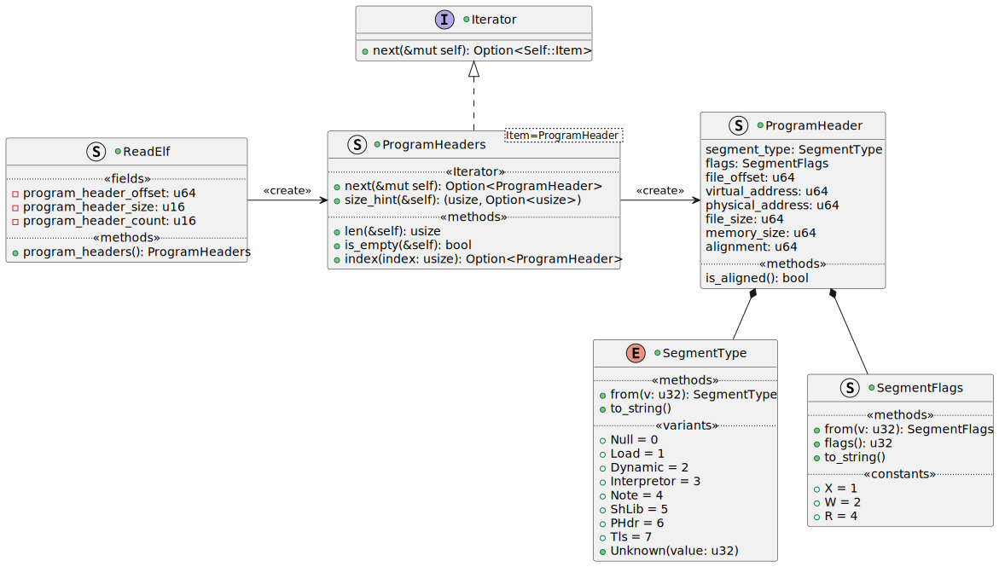

# Design for ReadElf <!-- omit in toc -->

The Crate is intended to read ELF files from Unix like systems that other
applications can consume.

- [1. Goals of ReadElf](#1-goals-of-readelf)
- [2. Design](#2-design)
  - [2.1. Reading an ELF File](#21-reading-an-elf-file)
    - [2.1.1. Dynamic Behaviour of the File](#211-dynamic-behaviour-of-the-file)
  - [2.2. Reading the ELF Header](#22-reading-the-elf-header)
  - [2.3. Reading the Program Header](#23-reading-the-program-header)
  - [2.4. Data Types (Enum or Struct)](#24-data-types-enum-or-struct)
- [3. Test Cases](#3-test-cases)
  - [3.1. ELF Headers](#31-elf-headers)
  - [3.2. ELF Builder for Integration Tests](#32-elf-builder-for-integration-tests)

## 1. Goals of ReadElf

While other implementations exist for reading ELF files in Rust
([rust-elf](https://github.com/cole14/rust-elf),
[elfy](https://github.com/JerTH/elfy)), I don't want to restrict to rust `core`
only, and allow using the `std`. Dependencies should be minimised where
possible, and rely best only on `std` as far as possible.

Performance is not an initial goal, but some design decisions may be made that
will make this easier in the future, in particular using `mmap` if possible.

It should be Operating System agnostic, considering that an ELF file is just a
file, it shouldn't depend on the Operating System to read the ELF file.

## 2. Design

### 2.1. Reading an ELF File

The intent is to make it easy to read an ELF file, just by opening it. It should
implement the `Drop` trait if required for closing the handle. The `Drop` trait
makes the object non-copyable.

By keeping the file open, the interpretation of the ELF file is _lazy_. It is
possible to give it a buffer via `from_*()`, or a file via `open()`. When
opening a buffer, the maximum size of the ELF file is `usize`.


The `open()` and `from_*()` methods return an instance of the `struct ReadElf`,
or return an `None`.

#### 2.1.1. Dynamic Behaviour of the File

Then `open()` and `from_*()` methods use the same logic for interpreting an ELF
file. The difference comes down to how the file is read:

- Using a memory buffer, which then accesses the values as references inside the
  slice; or
- Using a file handle, which accesses the values via `seek` and `read` calls to
  the Operating System.

The `ReadElf` structure maintains a private field of the trait `BinParser`,
which has a concrete implementation either for reading memory buffers, or
reading from files.

The implementation for `get_usize` reads either a 32-bit value, or a 64-bit
value, depending on the ELF `Class` (32-bit or 64-bit). The result is a 64-bit
value (because a `usize` would incorrectly prevent a 64-bit ELF file from being
read on a 32-bit machine).


### 2.2. Reading the ELF Header

The header is at the first 52 bytes (ELF-32) or 64 bytes (ELF-64). The size of
fields differ between the two sizes. Just from the header we can obtain:

- Class (32-bit or 64-bit)
- Data (Big Endian or Little Endian)
- Version (there are two fields, one 8-bit, the other 32-bit) both of which
  should always be 1
- OS ABI
- Object type (Dynamic, Executable or Core)
- Target Instruction Set (but generally not the revision of the instruction set,
  which often changes over time)
- Flags, as interpreted by the Operating System and the target architecture.
- Entry point to start execution

Internal details for further parsing the ELF file:

- Program headers (offset, number, size)
- Section headers (offset, number, size)
- Index in the section header that contains the strings.

### 2.3. Reading the Program Header

The layout (size and ordering of the fields) of the program header depends on if
it is an ELF-32 or ELF-64. Each program header entry is of a fixed size defined
by `e_phentsize`, making the data structure at offset `e_phoff` an array of
`e_phnum` elements.

The minimum size for the `e_phentsize` is:

| Data         | Length    |
| ------------ | --------- |
| ELF32 (0x01) | 0x20 (32) |
| ELF64 (0x02) | 0x38 (56) |

Usually, the program headers start immediately after the ELF header, but it
doesn't need to be.

A method `ReadElf::program_headers()` will return an `Iterator` that can be used
to enumerate over all the program headers. The goal is to use the method similar
to:

```rust
fn show_program_headers(elf: &ReadElf) {
  for ph in elf.program_headers() {
    println!("{}", ph.type.to_string());
  }
}
```

The library would be organised as the following diagram, which is similar in the
idiom to how rust implements `String::chars()`.



Rust doesn't natively support bit-flag enumerations (that would allow strong
typing), so a `struct` is used with constants that the user would check
themselves.

An implementation for `impl IntoIterator for ReadElf` won't be made available as
an iterator for the section headers will also be needed later (especially to get
the strings).

To get the number of expected number of program header segments, use
`program_headers().len()`. The `Iterator::count(self)` is not implemented, as
it's a moving operation, and in case of errors in the file, the default
implementation from Rust would differ to the result of `len()`.

TODO: We'd also like to index the content of the array directly, if we don't
want to use iterators. The
[Rustonomicon](https://doc.rust-lang.org/nomicon/vec/vec-final.html) shows
something similar to a `impl Deref for ProgramHeaderIter { type Target =
[ProgramHeader]}`. Should check if this will work.

### 2.4. Data Types (Enum or Struct)

In C, the values of fields are constants only, typically defined with a
`#define`. Under rust, a choice was made to either define an `enum` (such as
`SegmentType`), or a `struct` (such as `Machine`). The type used has
consequences on how to interpret the data.

As Rust enumerations are not equivalent to their C/C++ counterparts:

- If a field is a list of possible values that is likely to extend often, a
  `struct` is chosen, such as `Machine`. Values that are unknown are handled as
  their underlying type. If a value might overlap, a `struct` must be used (so
  two different constants with the same value can be used).
- If a field is not expected to change often, or is important to interpret the
  contents of the ELF file (e.g. `Endian` or `Class`), an `enum` is chosen. This
  doesn't mean that the `enum` value won't extend in the future. Values that are
  unknown are associated with their variant `Unknown(v)`, or interpreting the
  `enum` fails with the `try_from()` method. The advantage of using an `enum` is
  better checking of conditions (such as `match` statements), where the compiler
  will ensure that all variants are handled, and that the same variant cannot be
  defined twice.

To properly handle extensions to `enum`s, such that an unknown value doesn't
necessarily lead to not being able to interpret the value, user code must handle
the `enum` in such a way it supports future extensions. Or that code has the
ability to use an unknown value, without it breaking on a future update of the
library.

Imagine the case for `SegmentType`, which is an `enum` similar to:

```rust
#[derive(Clone, Copy, Debug, Eq, PartialEq)]
#[repr(u32)]
pub enum SegmentType {
    Null = 0,
    Load = 1,
    Dynamic = 2,
    Interpreter = 3,
    Note = 4,
    ShLib = 5,
    ProgramHeader = 6,
    ThreadLocalStorage = 7,
    Unknown(u32),
}
```

Let's say that a newer version of the standard defines a value of `8`, but it is
not supported by the library. When the library interprets the value, it will
create the `enum` value of `SegmentType::Unknown(8)`. The following code would
tie the application to a specific implementation of the library, *which is not
desired*.

```rust
let t = SegmentType::from(8);
if t == SegmentType::Unknown(8) {
  println!("SegmentType: NEW_SEGMENT");
}
```

If the library extended now that the value 8 is no longer unknown, the code
above would now change. The same issue appears when using `match` also, do not
match `Unknown(v)`. Instead, in these cases, ensure to use the following code
same instead for `Unknown(v)` values:

```rust
let t = SegmentType::from(8);
if t == u32::from(t) == 8 {
  println!("SegmentType: NEW_SEGMENT");
}
```

In this case, the `from(v: SegmentType)` method will always convert to the
correct value, and the code will continue to work. For known types, one can
still use the correct `enum` variant for readability - this only applies to
variants not yet supported by the library.

## 3. Test Cases

### 3.1. ELF Headers

There are a large number of ELF header binaries in the folder
`resources/tests/elf`. These intentionally only contain the first 64-bytes for
testing. Placing the full binary may be problematic:

- Binaries in GIT are not ideal;
- avoid copyright information

Instead, see the sources from the folder name. I downloaded the images and
extracted the files for testing.

### 3.2. ELF Builder for Integration Tests

The `tests/common/builder.rs` module is a simpler builder for ELF files. Having
a builder makes it easier to cover non-common use use cases by mocking our own
ELF files and also injecting errors.

The structure of the fictitious ELF file is determined upfront to make it
simpler to implement.

```text
                                 Offset (32 / 64-bit)
+------------------------------+
| ELF Header (52 or 64 bytes)  |  0x0000
+------------------------------+
| Array of Segments            |  0x0034 (32-bit) / 0x0040 (64-bit)
+------------------------------+
| Array of Sections            |  0x0400 - 0x07FF
+------------------------------+
| Data for Segments / Sections |  0x0800 - 0x1FFF
+------------------------------+
```

This way, we use 4096 byte preallocated array upfront. It's easy to add data,
segments and sections.
