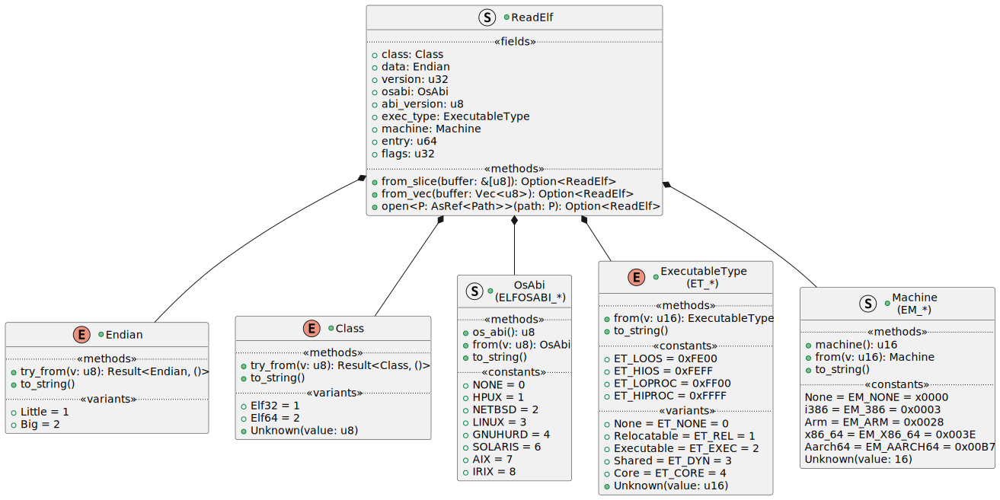
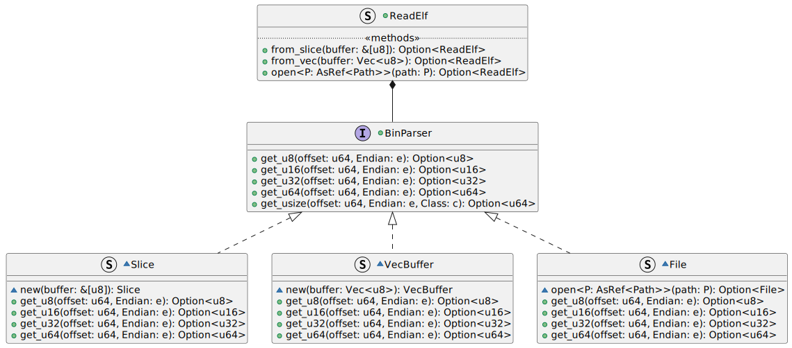

# Design for ReadElf <!-- omit in toc -->

The Crate is intended to read ELF files from Unix like systems that other
applications can consume.

- [1. Goals of ReadElf](#1-goals-of-readelf)
- [2. Design](#2-design)
  - [2.1. Reading an ELF File](#21-reading-an-elf-file)
    - [2.1.1. Dynamic Behaviour of the File](#211-dynamic-behaviour-of-the-file)
- [3. Test Cases](#3-test-cases)
  - [3.1. ELF Headers](#31-elf-headers)

## 1. Goals of ReadElf

While other implementations exist for reading ELF files in Rust
([rust-elf](https://github.com/cole14/rust-elf),
[elfy](https://github.com/JerTH/elfy)), I don't want to restrict to rust `core`
only, and allow using the `std`. Dependencies should be minimised where
possible, and rely best only on `std` as far as possible.

Performance is not an initial goal, but some design decisions may be made that
will make this easier in the future, in particular using `mmap` if possible.

It should be Operating System agnostic, considering that an ELF file is just a
file, it shouldn't depend on the Operating System to read the ELF file.

## 2. Design

### 2.1. Reading an ELF File

The intent is to make it easy to read an ELF file, just by opening it. It should
implement the `Drop` trait if required for closing the handle. The `Drop` trait
makes the object non-copyable.

By keeping the file open, the interpretation of the ELF file is _lazy_. It is
possible to give it a buffer via `from_*()`, or a file via `open()`. When
opening a buffer, the maximum size of the ELF file is `usize`.

The `open()` and `from_*()` methods return an instance of the `struct ReadElf`,
or return an `None`.

#### 2.1.1. Dynamic Behaviour of the File

Then `open()` and `from_*()` methods use the same logic for interpreting an ELF
file. The difference comes down to how the file is read:

- Using a memory buffer, which then accesses the values as references inside the
  slice; or
- Using a file handle, which accesses the values via `seek` and `read` calls to
  the Operating System.

The `ReadElf` structure maintains a private field of the trait `BinParser`,
which has a concrete implementation either for reading memory buffers, or
reading from files.

The implementation for `get_usize` reads either a 32-bit value, or a 64-bit
value, depending on the ELF `Class` (32-bit or 64-bit). The result is a 64-bit
value (because a `usize` would incorrectly prevent a 64-bit ELF file from being
read on a 32-bit machine).

## 3. Test Cases

### 3.1. ELF Headers

There are a large number of ELF header binaries in the folder
`resources/tests/elf`. These intentionally only contain the first 64-bytes for
testing. Placing the full binary may be problematic:

- Binaries in GIT are not ideal;
- avoid copyright information

Instead, see the sources from the folder name. I downloaded the images and
extracted the files for testing.
