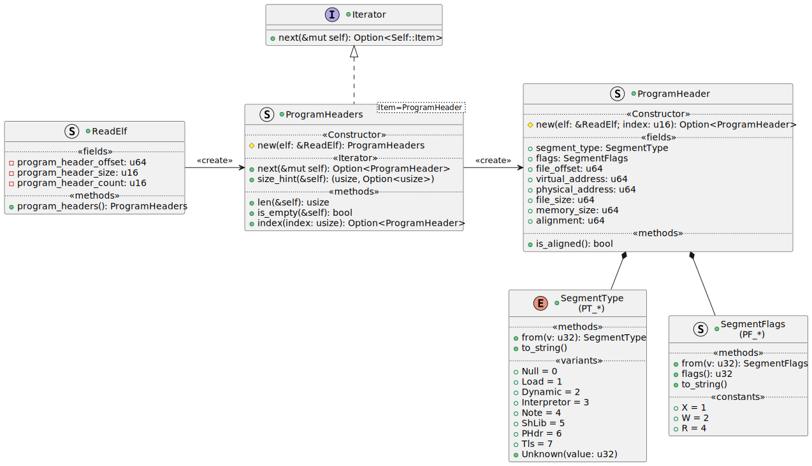

# Design for ReadElf <!-- omit in toc -->

The Crate is intended to read ELF files from Unix like systems that other
applications can consume.

- [1. Goals of ReadElf](#1-goals-of-readelf)
- [2. Design](#2-design)
  - [2.1. Reading an ELF File](#21-reading-an-elf-file)
    - [2.1.1. Dynamic Behaviour of the File](#211-dynamic-behaviour-of-the-file)
  - [2.2. Reading the ELF Header](#22-reading-the-elf-header)
  - [2.3. Reading the Program Header](#23-reading-the-program-header)
    - [2.3.1. Program Header Iterators](#231-program-header-iterators)
    - [2.3.2. Indexing into the Program Header](#232-indexing-into-the-program-header)
  - [2.4. Reading Section Headers](#24-reading-section-headers)
    - [2.4.1. Section Header Iterators](#241-section-header-iterators)
    - [2.4.2. The Section Name](#242-the-section-name)
    - [2.4.3. Decoding Sections for the Name of the Section](#243-decoding-sections-for-the-name-of-the-section)
  - [2.5. Data Types (Enum or Struct)](#25-data-types-enum-or-struct)
- [3. Test Cases](#3-test-cases)
  - [3.1. Organisation of Tests](#31-organisation-of-tests)
  - [3.2. Integration Tests](#32-integration-tests)
  - [3.3. Examples](#33-examples)
    - [3.3.1. `readelf` Dump Tool](#331-readelf-dump-tool)

## 1. Goals of ReadElf

While other implementations exist for reading ELF files in Rust
([rust-elf](https://github.com/cole14/rust-elf),
[elfy](https://github.com/JerTH/elfy)), I don't want to restrict to rust `core`
only, and allow using the `std`. Dependencies should be minimised where
possible, and rely best only on `std` as far as possible.

Performance is not an initial goal, but some design decisions may be made that
will make this easier in the future, in particular using `mmap` if possible.

It should be Operating System agnostic, considering that an ELF file is just a
file, it shouldn't depend on the Operating System to read the ELF file.

## 2. Design

### 2.1. Reading an ELF File

The intent is to make it easy to read an ELF file, just by opening it. It should
implement the `Drop` trait if required for closing the handle. The `Drop` trait
makes the object non-copyable.

By keeping the file open, the interpretation of the ELF file is _lazy_. It is
possible to give it a buffer via `from_*()`, or a file via `open()`. When
opening a buffer, the maximum size of the ELF file is `usize`.


The `open()` and `from_*()` methods return an instance of the `struct ReadElf`,
or return an `None`.

#### 2.1.1. Dynamic Behaviour of the File

Then `open()` and `from_*()` methods use the same logic for interpreting an ELF
file. The difference comes down to how the file is read:

- Using a memory buffer, which then accesses the values as references inside the
  slice; or
- Using a file handle, which accesses the values via `seek` and `read` calls to
  the Operating System.

The `ReadElf` structure maintains a private field of the trait `BinParser`,
which has a concrete implementation either for reading memory buffers, or
reading from files.

The implementation for `get_usize` reads either a 32-bit value, or a 64-bit
value, depending on the ELF `Class` (32-bit or 64-bit). The result is a 64-bit
value (because a `usize` would incorrectly prevent a 64-bit ELF file from being
read on a 32-bit machine).


### 2.2. Reading the ELF Header

The header is at the first 52 bytes (ELF-32) or 64 bytes (ELF-64). The size of
fields differ between the two sizes. Just from the header we can obtain:

- Class (32-bit or 64-bit)
- Data (Big Endian or Little Endian)
- Version (there are two fields, one 8-bit, the other 32-bit) both of which
  should always be 1
- OS ABI
- Object type (Dynamic, Executable or Core)
- Target Instruction Set (but generally not the revision of the instruction set,
  which often changes over time)
- Flags, as interpreted by the Operating System and the target architecture.
- Entry point to start execution

Internal details for further parsing the ELF file:

- Program headers (offset, number, size)
- Section headers (offset, number, size)
- Index in the section header that contains the strings.

### 2.3. Reading the Program Header

The layout (size and ordering of the fields) of the program header depends on if
it is an ELF-32 or ELF-64. Each program header entry is of a fixed size defined
by `e_phentsize`, making the data structure at offset `e_phoff` an array of
`e_phnum` elements.

The minimum size for the `e_phentsize` is:

| Data         | Length    |
| ------------ | --------- |
| ELF32 (0x01) | 0x20 (32) |
| ELF64 (0x02) | 0x38 (56) |

Usually, the program headers start immediately after the ELF header, but it
doesn't need to be.

#### 2.3.1. Program Header Iterators

A method `ReadElf::program_headers()` will return an `Iterator` that can be used
to enumerate over all the program headers. The goal is to use the method similar
to:

```rust
fn show_program_headers(elf: &ReadElf) {
  for ph in elf.program_headers() {
    println!("{}", ph.segment_type.to_string());
  }
}
```

The library would be organised as the following diagram, which is similar in the
idiom to how rust implements `String::chars()`.



Rust doesn't natively support bit-flag enumerations (that would allow strong
typing), so a `struct` is used with constants that the user would check
themselves.

An implementation for `impl IntoIterator for ReadElf` won't be made available as
an iterator for the section headers will also be needed later (especially to get
the strings).

To get the number of expected number of program header segments, use
`program_headers().len()`. The `Iterator::count(self)` is not implemented, as
it's a moving operation, and in case of errors in the file, the default
implementation from Rust would differ to the result of `len()`.

#### 2.3.2. Indexing into the Program Header

A method `index()` is provided to get a `ProgramHeader` for a specified index.

```rust
fn show_program_headers(elf: &ReadElf) {
  let hdr = elf.program_headers().index(0).unwrap();
  println!("{}", hdr.segment_type.to_string());
}
```

### 2.4. Reading Section Headers

The layout (size and ordering of the fields) of the section header depends on if
it is an ELF-32 or ELF-64. Each section header entry is of a fixed size defined
by `e_shentsize`, making the data structure at offset `e_shoff` an array of
`e_shnum` elements.

The minimum size for the `e_shentsize` is:

| Data         | Length    |
| ------------ | --------- |
| ELF32 (0x01) | 0x28 (40) |
| ELF64 (0x02) | 0x40 (64) |

#### 2.4.1. Section Header Iterators

The design for iterating over section headers is (for consistency) very similar
to that of program headers. The section headers is an array in the ELF file,
which can be directly indexed.


#### 2.4.2. The Section Name

The section name is read from the section with index `e_shstrndx` from the
section table. That section must be decoded and the contents loaded into memory.
Once in memory, the section `sh_name` is an offset into this section where the
C-String begins (and ends with a `NUL` terminator).

It must be noted that:

- The `e_shstrndx` must be a valid index in the range of `0..e_shnum`.
- Of course it must be in the file and loadable via the `sh_offset` and is of
  size `sh_size`.
- A string offset in the section must not necessarily point to the beginning of
  a string (it can reuse a string, or point to the middle of another string).
  This means we can't just read the section and parse all strings without
  knowing the offset prior.

#### 2.4.3. Decoding Sections for the Name of the Section

Obtaining the section names requires decoding the string section. A new `struct
StringsSection` that takes a `SectionHeader` is required. The `SectionHeader`
has the ranges in the ELF file to know what to read.

The trait `BinParser` will have the method `get_map` that will return a slice
(contained within `enum Buffer`) with the contents of the string section. For
the `binparser::slice::Slice` and `binparser::vecbuffer::VecBuffer`, this will
be an immutable reference to the existing buffer. For `binparser::file::File`,
it will create a new buffer and read the contents to disk. This puts the
restriction that the size of the section must be sufficiently small to fit in
memory of the process.


The cyclic dependency of having a `SectionHeader` first without a
`StringSection` is resolved by passing a `Option<StringSection>` to the
`SectionHeader::new()`. Should no `StringSection` be provided, the
`SectionHeader::name` is `None`. Thus, to iterate over the sections and get the
names of the sections:

- Get the section at index `ReadElf::string_section_index`, with no names.
- Create the `StringSection`, which loads (if necessary) the section into memory.
- The `SectionHeaders` now iterates from `0..ReadElf::section_header_count`
  getting each section, giving the constructor the `StringSection`, which it can
  use to convert the `CStr` to a rust `String`.

It is assumed that the section names are in UTF-8, a NUL terminated c-string. If
this is not the case, the string at the given offset will be `None`.

The `enum Buffer` is needed for safe Rust. It either contains a reference to
within the buffer that the `BinParser` already owns (e.g. from a slice or a
vector), or returns a new buffer if it isn't in memory already. It's not
possible to return a `&[u8]` as something must own that memory, of which the
`binparser::file::File` shouldn't own.

### 2.5. Data Types (Enum or Struct)

In C, the values of fields are constants only, typically defined with a
`#define`. Under rust, a choice was made to either define an `enum` (such as
`SegmentType`), or a `struct` (such as `Machine`). The type used has
consequences on how to interpret the data.

As Rust enumerations are not equivalent to their C/C++ counterparts:

- If a field is a list of possible values that is likely to extend often, a
  `struct` is chosen, such as `Machine`. Values that are unknown are handled as
  their underlying type. If a value might overlap, a `struct` must be used (so
  two different constants with the same value can be used).
- If a field is not expected to change often, or is important to interpret the
  contents of the ELF file (e.g. `Endian` or `Class`), an `enum` is chosen. This
  doesn't mean that the `enum` value won't extend in the future. Values that are
  unknown are associated with their variant `Unknown(v)`, or interpreting the
  `enum` fails with the `try_from()` method. The advantage of using an `enum` is
  better checking of conditions (such as `match` statements), where the compiler
  will ensure that all variants are handled, and that the same variant cannot be
  defined twice.

To properly handle extensions to `enum`s, such that an unknown value doesn't
necessarily lead to not being able to interpret the value, user code must handle
the `enum` in such a way it supports future extensions. Or that code has the
ability to use an unknown value, without it breaking on a future update of the
library.

Imagine the case for `SegmentType`, which is an `enum` similar to:

```rust
#[derive(Clone, Copy, Debug, Eq, PartialEq)]
#[repr(u32)]
pub enum SegmentType {
    Null = 0,
    Load = 1,
    Dynamic = 2,
    Interpreter = 3,
    Note = 4,
    ShLib = 5,
    ProgramHeader = 6,
    ThreadLocalStorage = 7,
    Unknown(u32),
}
```

Let's say that a newer version of the standard defines a value of `8`, but it is
not supported by the library. When the library interprets the value, it will
create the `enum` value of `SegmentType::Unknown(8)`. The following code would
tie the application to a specific implementation of the library, *which is not
desired*.

```rust
let t = SegmentType::from(8);
if t == SegmentType::Unknown(8) {
  println!("SegmentType: NEW_SEGMENT");
}
```

If the library extended now that the value 8 is no longer unknown, the code
above would now change. The same issue appears when using `match` also, do not
match `Unknown(v)`. Instead, in these cases, ensure to use the following code
same instead for `Unknown(v)` values:

```rust
let t = SegmentType::from(8);
if u32::from(t) == 8 {
  println!("SegmentType: NEW_SEGMENT");
}
```

In this case, the `from(v: SegmentType)` method will always convert to the
correct value, and the code will continue to work. For known types, one can
still use the correct `enum` variant for readability - this only applies to
variants not yet supported by the library.

## 3. Test Cases

### 3.1. Organisation of Tests

There are three types of test programs available in this crate:

- Unit tests, which are in the same file as a new module in the source code
  itself;
- Integration tests, which are reading the entire ELF file using `ReadElf` to
  test specific functionality. Not everything can be easily unit tested, as it
  depends on the original ELF file to construct. Such an example is the
  `ProgramHeadeers` iterator.
- Example programs, which are another type of test, when built, can perform
  integration tests not in this repository.

### 3.2. Integration Tests

For information about the structure of the integration tests, refer to
[README.md](../tests/README.md).

### 3.3. Examples

#### 3.3.1. `readelf` Dump Tool

There is the [`readelf`](../examples/readelf.md)
